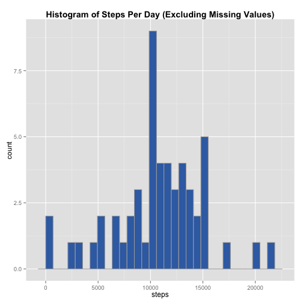
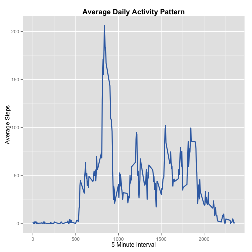
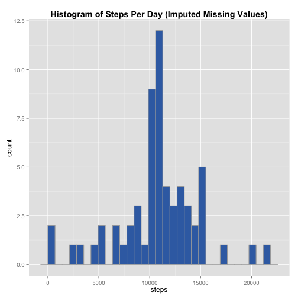
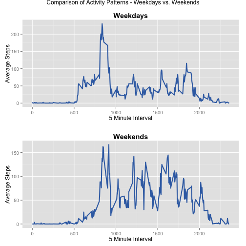

Reproducible Research Peer Assessment 1
---------------------------------------

This document is the result of using a literate programming approach to summarise the data processing and analysis required of Peer Assessment 1 in the Coursera Reproducible Research class. 

Josh Venman, 17th April, 2015

## Introduction

It is now possible to collect a large amount of data about personal movement using activity monitoring devices such as a Fitbit, Nike Fuelband, or Jawbone Up. These type of devices are part of the "quantified self" movement - a group of enthusiasts who take measurements about themselves regularly to improve their health, to find patterns in their behavior, or because they are tech geeks. But these data remain under-utilized both because the raw data are hard to obtain and there is a lack of statistical methods and software for processing and interpreting the data.

This assignment makes use of data from a personal activity monitoring device. This device collects data at 5 minute intervals through out the day. The data consists of two months of data from an anonymous individual collected during the months of October and November, 2012 and include the number of steps taken in 5 minute intervals each day.

###Data

The data for this assignment can be downloaded from the course web site:

- Dataset: [Activity monitoring data](https://d396qusza40orc.cloudfront.net/repdata%2Fdata%2Factivity.zip) [52K]

The variables included in this dataset are:

- **steps**: Number of steps taking in a 5-minute interval (missing values are coded as NA)

- **date**: The date on which the measurement was taken in YYYY-MM-DD format

- **interval**: Identifier for the 5-minute interval in which measurement was taken

The dataset is stored in a comma-separated-value (CSV) file and there are a total of 17,568 observations in this dataset.


## Loading and preprocessing the data


```r
library(ggplot2)
library(gridExtra)
```


```r
# Go to the directory where the activity.csv file has been unzipped and read the file in to a dataframe
# coercing the string data in column 2 in to a date format.
setwd("~/Dropbox/Learning/Coursera/Data Science/Reproducible Research/RepData_PeerAssessment1")
activities <- read.csv(file="activity.csv", header=TRUE, na.strings="NA", 
                       colClasses=c("integer","Date","integer"))
```

## What is mean total number of steps taken per day?


```r
# Calculate total steps for each day
totalStepsPerDay <- aggregate(steps ~ date,na.omit(activities),sum)

#  Calculate mean and median for total steps per day
meanStepsPerDay <- mean(totalStepsPerDay[,2])
medianStepsPerDay <- median(totalStepsPerDay[,2])
```

The mean total number of steps taken per day is **1.0766189 &times; 10<sup>4</sup>**. The median number of steps taken per day is **10765**. 


```r
ggplot() + geom_histogram(data=totalStepsPerDay,aes(x=steps),color="DarkGray", fill="#396eb2") + 
        ggtitle("Histogram of Steps Per Day (Excluding Missing Values)") + 
        theme(plot.title = element_text(lineheight=.8, face="bold"))
```

```
## stat_bin: binwidth defaulted to range/30. Use 'binwidth = x' to adjust this.
```

 

The histogram plot above illustrates the distribution of total steps per day for all the measured days, **excluding** missing values.


## What is the average daily activity pattern?


```r
# Calculate mean steps per 5-minute interval across all days excluding missing values
meanStepsPerInterval <- aggregate(steps ~ interval,na.omit(activities),mean)

# Produce a time series plot of the 5-min interval and the avg number of steps taken, averaged across all days
ggplot() + geom_line(data=meanStepsPerInterval,aes(interval,steps),color="#396eb2", size=1) + 
        labs(x="5 Minute Interval", y="Average Steps") + ggtitle("Average Daily Activity Pattern") + 
        theme(plot.title = element_text(lineheight=.8, face="bold"))
```

 

```r
# Determine the 5-minute interval that contains the maximum steps
maxStepInterval <- meanStepsPerInterval[order(meanStepsPerInterval$steps, decreasing=TRUE),][1,"interval"] 
```

On average, across all days in the dataset, the 5-minute interval containing the maximum steps is at **835**.


## Imputing missing values


```r
# Calculate  the total num of missing values in the dataset (ie total rows with NA)
numMissingValues <- length(which(is.na(activities$steps)))
```

The total number of missing values in the dataset was **2304**.


The strategy adopted for imputing the missing values in the dataset was to replace the NA values with the mean steps for the same time interval across all days as already calculated and stored in the **meanStepsPerInterval** dataframe.


```r
# Setup function to handle replacement of missing values
replaceMissingSteps <- function(d,ms) {
        # Examine each row in the activities dataframe. If the steps value is NA then replace it
        # with the mean steps value for that time interval across all days based on the data contained im
        # the second function parameter.
        
        for (i in 1:nrow(d)) {
                if (is.na(d[i,1])) d[i,1] <- subset(ms,interval == d[i,3])[,"steps"]        
        }
        # Return the dataframe, now with no NA values
        d
}

# Create new dataset that is equal to the opriginal dataset, but with the missing data filled in.
modActivities <- replaceMissingSteps(activities,meanStepsPerInterval)
```


```r
# Calculate new steps per day dataframe with missing values replaced
modTotalStepsPerDay <- aggregate(steps ~ date,modActivities,sum)

# Generate histogram with new dataset
ggplot() + geom_histogram(data=modTotalStepsPerDay,aes(x=steps),color="DarkGray", fill="#396eb2") + 
        ggtitle("Histogram of Steps Per Day (Imputed Missing Values)") + 
        theme(plot.title = element_text(lineheight=.8, face="bold"))
```

```
## stat_bin: binwidth defaulted to range/30. Use 'binwidth = x' to adjust this.
```

 

The histogram plot above illustrates the distribution of total steps per day for all the measured days, with **missing values replaced** with the mean steps for the same time interval across all days.


```r
#  Calculate mean and median for total steps per day
modMeanStepsPerDay <- mean(modTotalStepsPerDay[,2])
modMedianStepsPerDay <- median(modTotalStepsPerDay[,2])
```

After replacing the missing values, the mean total number of steps taken per day is **1.0766189 &times; 10<sup>4</sup>** and the median number of steps taken per day is **1.0766189 &times; 10<sup>4</sup>**. The median and the mean are now the same with the median value having increased slightly.

        
## Are there differences in activity patterns between weekdays and weekends?


```r
# Setup function to handle lookup of data to determine wheth it is a weekday or weekend.
getDayStatus <- function(d) {
        # Determine whether the supplied date is a weekday or weekend day and return "weekend" or "weekday".
        dow = weekdays(d)
        ifelse(dow =="Saturday" | dow =="Sunday", "weekend","weekday")
}

# Create a new factor variable in the dataset with two levels "weekday" and "weekend" 
modActivities <- cbind(modActivities,daystatus = getDayStatus(modActivities$date))

# Calculate the average steps per 5 minute time interval across all weekend and weekday days
weekdayStepsPerInterval <- aggregate(steps ~ interval,subset(modActivities,daystatus == "weekday"),mean)
weekendStepsPerInterval <- aggregate(steps ~ interval,subset(modActivities,daystatus == "weekend"),mean)
```


```r
# Generate plot for weekday average steps
p1 <- ggplot() + geom_line(data=weekdayStepsPerInterval,aes(interval,steps),color="#396eb2", size=1) + 
        labs(x="5 Minute Interval", y="Average Steps") + ggtitle("Weekdays") + 
        theme(plot.title = element_text(lineheight=.8, face="bold"))

# Generate plot for weekend average steps
p2 <- ggplot() + geom_line(data=weekendStepsPerInterval,aes(interval,steps),color="#396eb2", size=1) + 
        labs(x="5 Minute Interval", y="Average Steps") + ggtitle("Weekends") + 
        theme(plot.title = element_text(lineheight=.8, face="bold"))


# Put both plots in one gridded plot and apply a main title
grid.arrange(p1, p2, nrow=2, ncol=1, main="Comparison of Activity Patterns - Weekdays vs. Weekends")
```

 

The time series plot above compares the average activity patterns across the day for week days and weekend days. It is clear from this plot that during weekend days, there is more activity and resulting steps in the afternoon hours. This difference could be explained by the majority of people being at work during these hours during week days.

